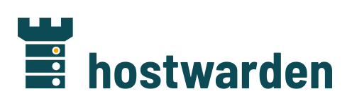

<picture>
  <source media="(prefers-color-scheme: dark)" srcset="svg/hostwarden-lockup-invers.svg">
  
</picture>

# Hostwarden brand

The mark of [Hostwarden](https://github.com/hostwarden/hostwarden): a
tower whose courses are rack units, the warden over the hosts. One
LED is lit, in signal yellow. Someone is watching.

Everything here is computed, not drawn. `src/generate.py` builds
every file in `svg/` and `png/` from the tower's geometry and the
font's outlines, and CI checks that the committed files are exactly
what it writes. A variant that is missing is added to the generator,
never made in an image editor, or the mark exists twice and the
copies drift apart.

```sh
python3 -m venv .venv
.venv/bin/pip install -r requirements.txt
.venv/bin/python src/generate.py
```

## Which file where

- `png/hostwarden-avatar-1024.png`: the GitHub organization avatar.
  GitHub rounds the corners itself.
- `png/hostwarden-social-preview.png`: a repository's social preview
  (Settings → Social preview), 1280 × 640.
- `svg/hostwarden-signet.svg`: the mark on its petrol square.
- `svg/hostwarden-signet-free.svg`: the petrol tower without a
  ground, for light backgrounds; `-invers` is the frost tower for
  dark ones.
- `svg/hostwarden-wordmark.svg`: the word alone, in petrol;
  `-invers` in frost.
- `svg/hostwarden-lockup.svg`: tower and word side by side, for light
  backgrounds; `-invers` for dark ones. `png/` has both at 1200 px.
- `png/favicon-*.png`, `png/apple-touch-icon-180.png`: browser tab
  and home screen.

The LED bezels are holes, not painted circles, so the marks without
a ground show whatever they sit on.

## Color

- Petrol `#0C4A55`: the mark on light grounds, the square, the
  social preview.
- Deep `#072E36`: dark grounds.
- Frost `#ECF2F1`: light grounds, the tower on petrol.
- Stone `#A9BDBF`: secondary text on petrol.
- Signal `#F9A800`: the lit LED and nothing else (RAL 1003).

Contrast: petrol on frost 8.7:1, frost on deep 12.8:1, stone on
petrol 5.0:1, signal against petrol 5.0:1. Signal on frost is only
1.7:1, which is why the lit LED always sits in a petrol bezel and
signal never carries text. Frost is a cool white on purpose; a warm
cream would pull the mark toward other brands' palettes.

## Type

Barlow Semi Condensed, Bold for the word and Medium for the social
preview's lines, under the SIL Open Font License
(`src/fonts/OFL.txt`). Barlow draws on California's highway signs,
which suits a project about guardrails. The word is outlines, not
set text, so no output file needs the font installed. It is written
in lower case, like the command.

## Rules

- Clear space around every mark: a quarter of the tower's height.
- In the lockup the word stands on the tower's base line, its
  x-height 0.37 of the tower's height, 0.2 of that height apart.
- Smallest sizes: the signet 16 px, the lockup 120 px wide.
- Never recolor, stretch, rotate or outline the mark, and never
  light a second LED.

## License

The generator is MIT licensed (`LICENSE`). The name and the marks
are not: `TRADEMARKS.md` says how you may use them. The fonts are
under the SIL Open Font License.
